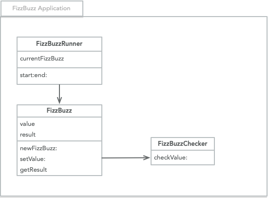
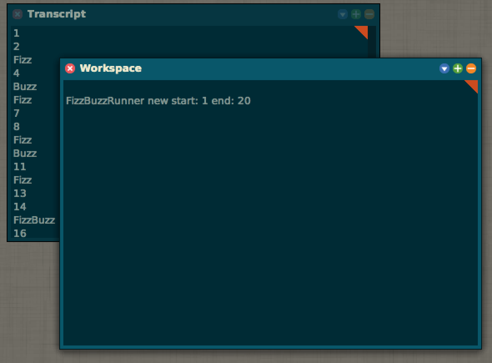

# Smalltalk

Smalltalk examples and concepts

## Smalltalk at a glance

[CMap Overview](cmaps/Smalltalk.pdf)

## The FizzBuzz sample

#### Description

The FizzBuzz solution contains of 3 files.

- FizzBuzz.st
- FizzBuzzChecker.st
- FizzBuzzRunner.st

After FileIn the source code to a Smalltalk image, the output can be started with the following command:

    FizzBuzzRunner new start: <startvalue> end: <endvalue>

Replace the placeholder <startvalue> and <endvalue> with your values of choice.

Example:

    FizzBuzzRunner new start: 1 end: 30

#### Class-Diagram

The relations between the different objects, I tried to illustrate as follows.

#### Screenshot from Squeak

